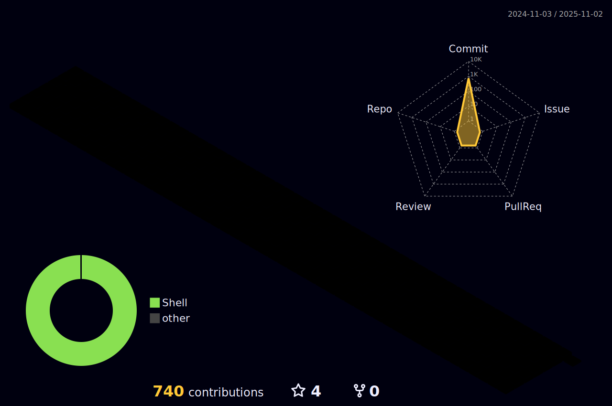

## 👋 Hi there:

- 📫 How to reach me: **zhang_nan_163@163.com**
- ⚙️ Working strategy: **Plan ‣ Design ‣ Execute ‣ Summary**

## 🪡 My artifacts: 
- Languages:
     
- Frameworks:
       
- IDE:
       
- Hardware: 
    
- Cloud:
   

## 🩻 Contribution:

## 😣 Stats:

